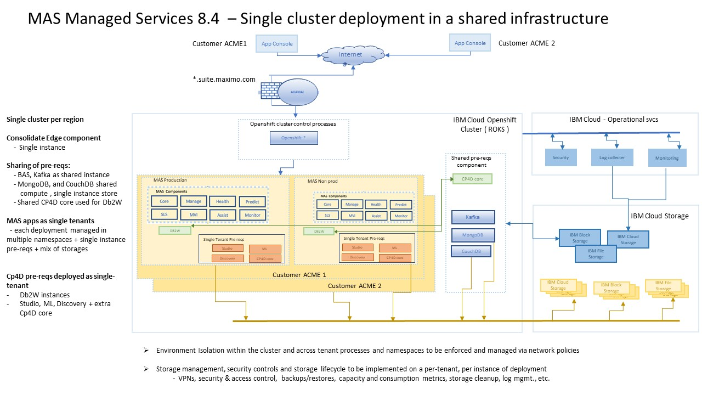

---

copyright:
  years: 2015, 2020
lastupdated: "2020-11-12"

subcollection: mas-ms

---

{:shortdesc: .shortdesc}
{:screen: .screen}  
{:codeblock: .codeblock}  
{:pre: .pre}
{:tip: .tip}
{:note: .note}
{:external: target="_blank" .external}

# Architecture
{: #architecture}

## Cloud Architecture
{: #cloud-architecture}

Maximo Application Suite (MAS) is a feature rich suite of applications delivered using key IBM and Red Hat technologies. The MAS Managed Service (MS) delivers this functionality on the IBM Cloud.

The current IBM Cloud data centers being leveraged for MAS-MS are:

- Washington, DC, United States
- Dallas, TX, United States
- Amsterdam, Netherlands
- Frankfurt, Germany
- London, UK
- Sydney, Australia
- Toronto, Canada
 
On site customer visits to IBM Cloud data centers are not allowed for security reasons. Street address locations of data centers are not disclosed. This is in accordance to IBM's NIST guidelines and AICPA Trust Services criteria.

IBM Cloud - YouTube Videos

Inside the heart of an IBM Cloud Data Center:

https://www.youtube.com/watch?v=HkIJTyjE4zo

Do you have a cloud designed for data?

https://www.youtube.com/watch?v=TrbQbM_xtBw

Further information on IBM Cloud Data Centers:

https://www.ibm.com/cloud/data-centers

## Network Architecture
{: #network-architecture}

IBM Cloud has a unique Triple Network architecture.  Every server provisioned in the IBM Cloud has 3 distinct networks:

* Public Network: Two network interfaces are dedicated to the public network.  This network serves as the internet facing network for the server.  IBM MAS-MS uses this network as the way for external clients to access the application. This network is also secured by a firewall pair managed by IBM Cloud Delivery Services. 

* Private Network: Two network interfaces are dedicated to the private network.  This network serves as a secure private network dedicated to IBM Cloud.  IBM Cloud uses this network for secure server to server communication as well as data center to data center communications.  This network has no access to the internet.

* Management Network: One network interface is dedicated to the Management network.  This secure out-of-band network is accessible via an IBM managed VPN.  It is used by IBM Cloud staff for maintenance and administration purposes such as firmware updates, OS reloads, power-cycle or other IPMI functions like keyboard, video, mouse control (KVM over IP).

For the MAS Managed Service each client is provisioned with their own application instance and dedicated namespace(s).  The IBM MAS-MS team will provision and configure all necessary underlying infrastructure and components.

IBM Cloud Data Centers are SOC compliant and have full hardware redundancy implemented for all servers. All data centers have an N1 redundant power and cooling infrastructure, including backup power generators. All servers have redundant power supplies, NICs and use SAN based RAID storage. 

The following diagram shows a high level overview of the architecture for each individual client instance.

{: caption="Figure 1. MAS-MS Architecture" caption-side="bottom"}

## MAS-MS Architecture Highlights
{: #mas-ms-architecture-highlights}

* MAS MS customers are provisioned two (2) environments by default: (1) PROD and (1) NON-PROD
* All clients will be provisioned in their own application instance using dedicated namespace(s)
* IT Administration for the PROD and NON-PROD environments is solely managed by IBM's MAS-MS operations team
* Clients can access PROD and NON-PROD systems via browser based URL
* MAS-MS is an internet based offering that runs over HTTPS. There is no private cloud or direct connect option for MAS-MS
* Clients are provided application administrator access for all applications ordered
* All servers are Red Hat Linux O/S
* Maximo Manage databases are IBM DB2.  Oracle and MS SQLServer are not supported.

## MAS-MS Integrations
{: #mas-ms-integrations}

IBM Maximo Application Suite Managed Service supports integration to / from external systems. There are different options available to provide secure integration connections such as SSL, VPN, and Cloud Object Storage integration. HTTPS (SSL) is the standard encryption method and is supported for XML based interfaces using HTTP Post and Web Service endpoints. In addition, the REST API is available over HTTPS. All these integration methods can also be implemented with authentication. Cloud Object Storage is available for integrations that require file based transfers. A Site-to-Site IPsec VPN Tunnel can also be established between the client network and the IBM cloud environment using IBM's firewall in order to support other integration transport methods.

 Integration options include, but are not limited to:

* Support for synchronous and asynchronous exchange of data with applications within the Suite
* Use of common protocols and format such as Web Services, HTTP, JMS, REST, OSLC, XML, JSON, XML and .csv files, DB tables
* Support of Create, Replace, Update, Delete and Query operation
* Support for customizing integration processing using Processing Rules and Scripting
     
For the MS-Manage Application:

* Maximo integration message generation and delivery based on application object events
* Support for implementation (batch) data loading
* Pre-defined (75+) interface components provided along with applications to configure new interfaces
* Support for customizing integration processing using Processing Rules and Scripting

For file based integrations, an IBM Cloud Object Storage location will be allocated for each order.  5 API Keys will be generated for the client to use to move files in and out of the location.  Additional keys can be ordered.  To initiate this process, customers must submit a support case.

One Site-to-Site VPN is included in the order.  To initiate the creation of this VPN, customers must submit a support case.  At this time, the VPN is only available for LDAP integrations.

For clients wanting to use App Connect or File integration for other applications within the suite:

- AppConnect is included as an entitlement with the Maximo Application Suite, but the Managed Service does not implement or support this within the MAS-MS environment.  The client is responsible for implementing AppConnect or beginning with version MAS v8.7, AppConnect SaaS will be supported.

- For clients wanting file integrations with applications other than Manage, this needs to be discussed with the Sales team and an appropriate solution implemented.  COS is only included for the Manage application in the Managed Service.
