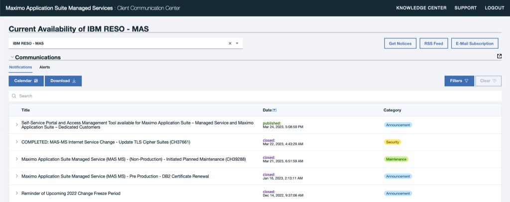

---

copyright:
  years: 2015, 2020
lastupdated: "2023-02-02"

subcollection: mas-ms

---

{:shortdesc: .shortdesc}
{:screen: .screen}
{:codeblock: .codeblock}
{:pre: .pre}
{:tip: .tip}
{:note: .note}
{:external: target="_blank" .external}

# Client Communications Center
{: #client-communications-center}

IBM MAS-Dedicated Client Communications Center URL:

https://status.suite.maximo.com/

{: caption="Figure 1. MAS-Dedicated CCC Main Page" caption-side="bottom"}

The IBM MAS-Dedicated Client Communication Center (CCC) is the primary communication channel for environment alerts, incidents, maintenance, security and announcement notices for all MAS-Dedicated customer environments.

It is important that all customers designate members of their staff to log in to the CCC and subscribe to email notifications in order to receive important information and notice of upcoming maintenance regarding their environment(s).

## CCC Access
{: #ccc-access}

### Access

Access to the Client Communication Center is managed through the Access Management application in the Self-Service Portal (SSP).  This self service tool allows clients to submit access requests for their environments and revoke accesses they no longer need.

To obtain access to the Client Communication Center, follow the steps in the following link to submit an Access Request:  [How to Request CCC Access](/docs/mas-ms?topic=mas-ms-ssp#how-to-request-ccc-access)

Please note an An IBMid and password is required to access the Client Communication Center.  If you do not have an IBMid, please sign up for one at:

https://www.ibm.com/account/us-en/signup/register.html

Once the IBMid is activated you will receive an email confirmation.

If you have any questions or concerns regarding this process please open a [Support Case](https://www.ibm.com/mysupport){: external}.

### Notifications

Once you are able to login to the CCC, you can sign up to receive notifications directly via or email or RSS Feed. Further information is provided below.

Email Subscription Important Notes:

* Users with access to the Client Communication Center are automatically subscribed.

* Select the **E-Mail Subscription** button (in the upper right hand corner) to subscribe to notification emails (announcements)

* Enter the email address for the user(s) who should receive email notifications. This option is provided to enable other members of your organization to still receive email announcements although they may not require access to the IBM Client Communication Center

* All emails referenced must be associated with an [IBMid](https://www.ibm.com/account/us-en/signup/register.html){: external}

* Multiple email addresses can be specified, separated by comma

* All announcement categories (Alert, Announcement, Incident, Maintenance, Security) are selected by default. Click the down arrow on the ‘Subscribe to’ field to uncheck any announcement types you do not wish to receive. All recipients entered in the Email field will receive the selected types

  | Notification Category | Description |
  | -------------- | -------------- |
  | Alert | Automatically generated system alerts. Alerts are not currently configured or in use. |
  | Announcement | General announcements regarding the MAS-MS and MAS-Dedicated platform. |
  | Incident | Communication of security incident or breach. |
  | Maintenance | Planned maintenance windows including initial announcement and status of maintenance work in progress. |
  | Security | Security specific announcements or planned maintenance related to a security issue. |
  {: caption="Table 1. CCC Notification Categories" caption-side="bottom"}

* Read the Privacy Policy terms

* Select the Subscribe button

* You can also unsubscribe to notifications by using the Subscription button, entering the email address and selecting the Unsubscribe button.

**RSS Feed**

Select the RSS feed icon to view feeds and add the URL to your Feed viewer
