---

copyright:
  years: 2015, 2020
lastupdated: "2020-11-12"

subcollection: mas-ms

content-type: tutorial
completion-time: 10m

---

{:shortdesc: .shortdesc}
{:screen: .screen}  
{:codeblock: .codeblock}  
{:pre: .pre}
{:tip: .tip}
{:note: .note}
{:external: target="_blank" .external}
{ :toc-completion-time="10m"}

# Getting started with IBM Maximo Application Suite Managed Service
{: #getting-started-with-ibm-maximo-application-suite-managed-service}
{: toc-content-type="tutorial"}
{: toc-completion-time="10m"}

## About
{: #about}

Maximo Application Suite Managed Service (MAS-MS) provides IBM managed provisioning, installation, configuration, operational support, security, maintenance and administration of Maximo Application Suite for customers on the IBM Cloud platform. MAS-MS combines key IBM technologies: IBM Cloud, Red Hat Open Shift, IBM Cloud Pak for Data and IBM Watson - into a focused MAS services solution, allowing customers to make implementation of product functionality & features a priority.

## Before you begin
{: #before-you-begin}

Before you can use Maximo Application Suite Managed Service, environments must first be ordered and provisioned by the IBM MAS-MS operations team. To obtain more information about the MAS-MS offering and available options, please contact your IBM Salesperson or an Authorized IBM Partner. If you do not have an IBM Saleperson or Authorized reseller, please complete and submit the consultation form (link below). An IBM representative will be in contact with you.

https://www.ibm.com/products/maximo?schedulerform=

## Part Numbers and Order Considerations
{: #part-numbers-and-order-considerations}

This section details the part numbers and considerations when placing an order for the Maximo Application Suite Managed Service.

Before submitting an order, the following should be considered to ensure the order is 'right sized' and will meet the requirements of the client.

Important:
Customers must purchase (or own) App Points for MAS prior to (or in conjunction with) ordering the IBM Managed Service. The managed service provides IBM Cloud based hosting, product installation, operation, maintenance and support for MAS.

Information should be gathered about the potential usage of the suite, including which applications will be required, how many users on each application and the primary usage of the applications.

There are three (3) MAS-MS part numbers:

* D02QTZX - Capacity
* D02QUZX - Data
* D02QWZX - VPC (Virtual Processor Core)

To correctly size an order, please use the MAS-MS Managed Service T-Shirt Calculator:

[Maximo Application Suite Managed Service T-Shirt Calculator v5.4](downloads/MAS-MS-Tshirt-Calculator-v5-4.xls){: external download="MAS-MS-Tshirt-Calculator-v5-4.xls"}

For additional information, please contact Mike Cookson:

michael.cookson@ibm.com

519-932-3511

## Welcome Letter
{: #welcome-letter}

When your MAS-MS environments have been provisioned, you will receive a Welcome Letter from the IBM MAS-MS Operations team. This letter will contain:

* The URLs of each environment that have been provisioned
* The username, corresponding email and password for each environment
* Information on how to activate your environment(s)
* Information on how to access your environment logs
* Information on downloading IBM Watson Studio and Watson Machine Learning (if applicable)

## How to activate your environment(s)
{: #how-to-activate-your-environments}

To complete the activation of your Maximo Application Suite environment, you must first generate and download Maximo Application Suite license keys and provide them to the IBM MAS-MS Operations team via case ticket. Your license keys will then be applied to your MAS-MS environments to activiate them. You will need one (1) license key file per environment (for example one license for PROD and one license for TEST). IBM License Key Center login information and credentials are provided in a separate License Key Center welcome letter for your organization. You will receive separate letters for each environment.

For further information on the IBM License Key Center, see the link below:

https://www.ibm.com/support/pages/ibm-support-licensing-start-page

To acquire your license keys:
1. Locate your IBM License Key Center Welcome Letter(s)
2. Login to the [IBM License Key Center](https://licensing.subscribenet.com/control/ibmr/login) using the credentials provided in the License Key Center Welcome Letter
3. Select your company name
4. Select the IBM AppPoints product line
5. Select the IBM MAXIMO APPLICATION SUITE license key name
6. Select the product or sales order for which to create the license key
7. Enter the number of keys to generate. These correspond to the AppPoints that are allocated to the license key
8. Provide the following Maximo Application Suite license server parameters. These are provided in your welcome letter:

    | Parameter | Value (Example) |
    | -------------- | -------------- |
    | Version | IBM Maximo Application Suite App Point License |
    | Configuration | Single License Server |
    | Host ID Type | Ethernet Address (Windows, Linux, UNIX or Solaris) |
    | Host ID | 99999xxx9x99 |
    | Hostname | customerinstancename-rlks-0.rlks |
    | Port | 27000 |
    | Description | Environment Name |
    {: caption="Table 1. MAS-MS License Key Parameter Examples" caption-side="bottom"}

9. Download your license key(s)
10. Open a case using the IBM Support Portal and upload the license key files to IBM by clicking the following link:

    https://www.ibm.com/mysupport/s/?language=en_US

    Note: to open a case, you must have an IBMid and have registered for Maximo Application Suite Support Services. After IBM receives your support case and attached license key(s), your environment will be activated and the case updated.

For further information on AppPoints, see the link below:

https://www.ibm.com/docs/en/mas86/8.6.0?topic=overview-apppoints

## How to Create an IBMid
{: #how-to-create-an-ibmid}

Note: If you already have an IBMid, please proceed to [How to Register for MAS-MS Support Services](#how-to-register-for-mas-ms-support-services)

1. To create an IBMid, click on the following link:
    https://myibm.ibm.com

2. Click **Create an IBMid**

    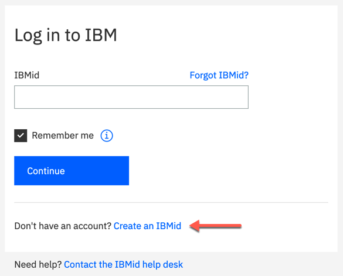{: caption="Figure 1. Create IBMid" caption-side="bottom"}

3. Enter the applicable information (you will need to provide a valid email address) and click **Next**

    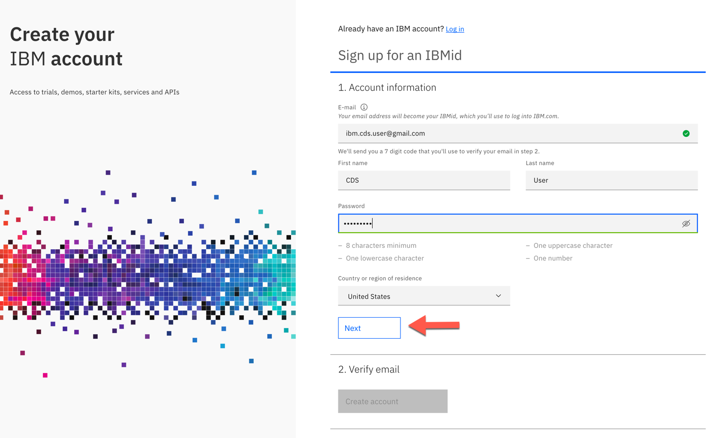{: caption="Figure 2. IBMid - Enter Applicable Information" caption-side="bottom"} 

4. Upon submission, a confirmation code will be sent from ibmacct@iam.ibm.com to the email address you provided

    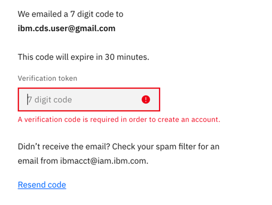{: caption="Figure 3. MAS-MS IBMid Confirmation Code" caption-side="bottom"} 

5. Open your email and copy & paste the 7 digit confirmation code (Verification token).
    Click **Create Account** to activate your IBMid 

    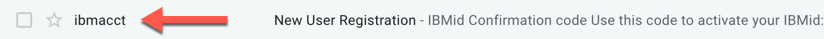{: caption="Figure 4. MAS-MS IBMid Confirmation Code Email" caption-side="bottom"} 

    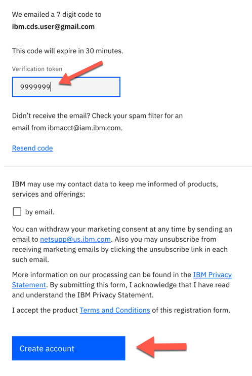{: caption="Figure 5. MAS-MS IBMid Create Account" caption-side="bottom"} 

     
6. Accept IBM Account Privacy notification by clicking **Proceed**

    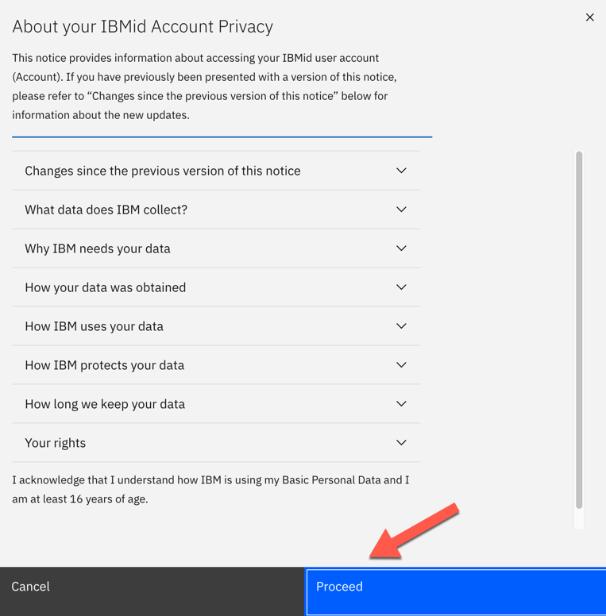{: caption="Figure 6. MAS-MS IBMid Privacy Notification" caption-side="bottom"} 

7. Your new IBMid will be created and registration completed:

    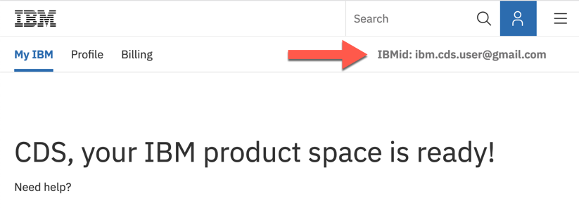{: caption="Figure 7. MAS-MS IBMid Ready" caption-side="bottom"}

    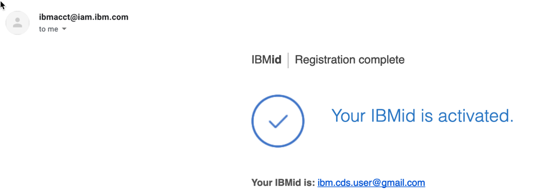{: caption="Figure 8. MAS-MS IBMid Activated" caption-side="bottom"}

After verification/creation of your IBMid has been completed, proceed to the next section [How to Register for MAS-MS Support Services](#how-to-register-for-mas-support)

## How to Register for Maximo Application Suite Support
{: #how-to-register-for-mas-support}
Maximo Application Suite support covers both the Application and your Managed Service (MS) environments.

1. Visit the following link:

    https://www.ibm.com/mysupport/s/supportaccess

2. Log in using your IBMid:

    Note: if you don't have an IBMid, please reference the following link: [How to Create an IBMid](#how-to-create-an-ibmid)

    {: caption="Figure 9. MAS-MS Register IBMid Login" caption-side="bottom"}
    
3. Privacy Statement may appear. If it does, click **I consent**

    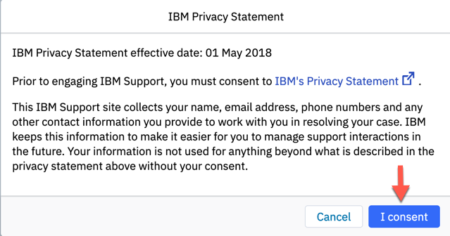{: caption="Figure 10. MAS-MS Register Privacy" caption-side="bottom"}

4. After entering your IBMid & password, the following page will be displayed.
    Click on the Request access button:

    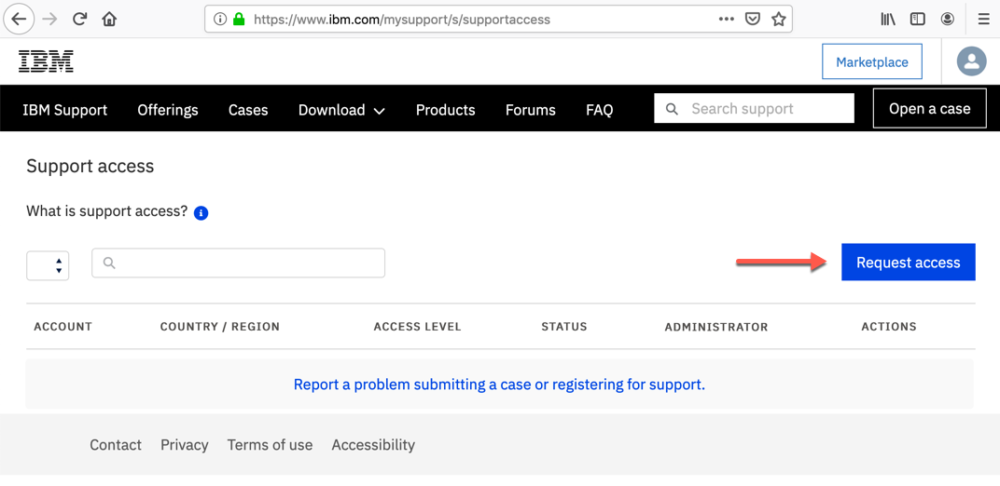{: caption="Figure 11. MAS-MS-Register-Request-Access" caption-side="bottom"}

5. The following dialog box will appear:

    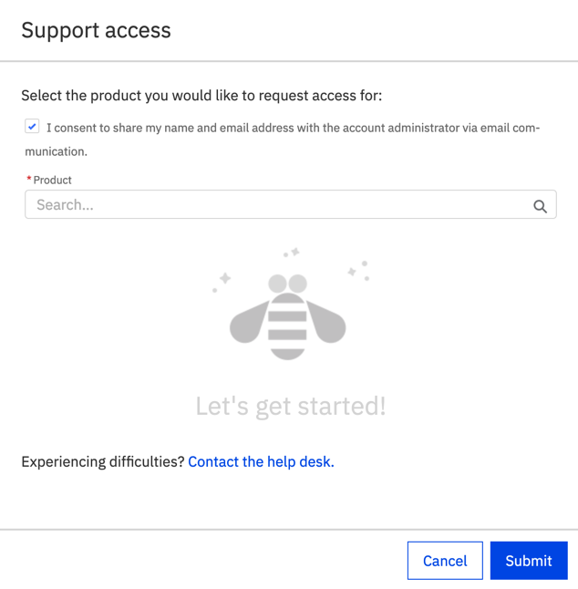{: caption="Figure 12. MAS-MS Request Access Dialog" caption-side="bottom"}

6. Be sure the I consent checkbox is checked, then type **Maximo Application Suite** in the Product field.
    Select **Maximo Application Suite** from the drop down list and click **Submit**

    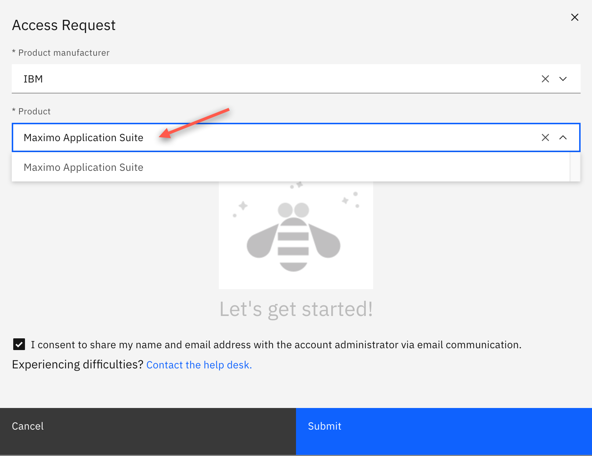{: caption="Figure 13. MAS-MS Select Product" caption-side="bottom"}
    
7. If you are not already registered for Maximo Application Suite support, the following screen will appear.
    Complete the applicable information. Ensure Client / account name is populated and click Submit 

    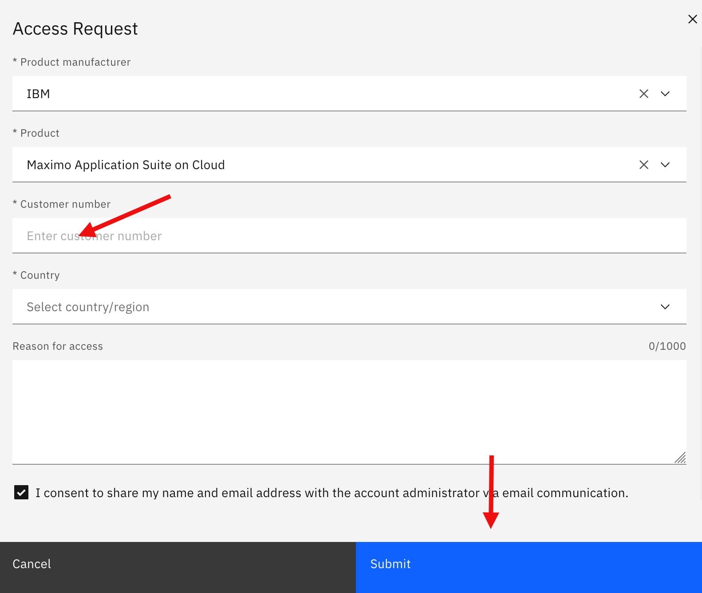{: caption="Figure 13. MAS-MS Enter Customer Number" caption-side="bottom"}
    
8. The following dialog will appear. Click **Close**

    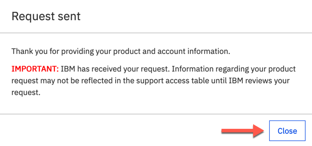{: caption="Figure 13. MAS-MS Request Sent" caption-side="bottom"}

9. An email notification will be sent confirming your request:

    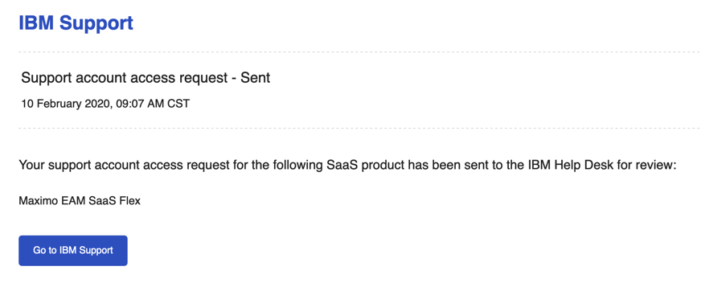{: caption="Figure 13. MAS-MS Request Sent Confirmation" caption-side="bottom"}

    Note: 
    Once you request has been submitted, please be patient. It will take some time (up to 24 hours) for IBM to review and approve your request.

    To confirm your access, login with your IBMid to the Support Access page:
   
    https://www.ibm.com/mysupport/s/supportaccess

    You should see your product access with a Status of ‘Approved’ under your ACCOUNT:

    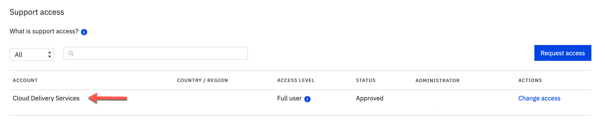{: caption="Figure 13. MAS-MS Request Approved" caption-side="bottom"}

    If you need support, see the next section [How to Create a Case](#how-to-create-a-case)

## How to Create a Case
{: #how-to-create-a-case}

## Next steps
{: #next-steps}

Designate member(s) of your staff to subscribe to the Client Communications Center (CCC) in order to receive important information and notifications regarding your environment(s):

https://status.suite.maximo.com

Refer to the Reference section for further information on MAS-MS operations and support, maintenance, security and the additional topics.

To add additional users to your account, login to Maximo Application Suite, click the administration icon in the menu bar, and select Administration > Users.

For further details on IBM Maximo Application Suite, please refer to IBM Maximo Application Suite documentation:

https://www.ibm.com/support/knowledgecenter/SSRHPA_current/appsuite/kc_welcome.html

To get help and support for your Maximo Application Suite Managed Service, see the IBM support guide on IBM.com:

https://www.ibm.com/support/pages/node/733923
