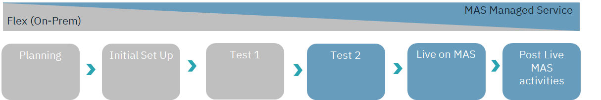

---

copyright:
  years: 2015, 2020
lastupdated: "2020-11-12"

subcollection: mas-ms

---

{:shortdesc: .shortdesc}
{:screen: .screen}  
{:codeblock: .codeblock}  
{:pre: .pre}
{:tip: .tip}
{:note: .note}
{:external: target="_blank" .external}

# Migration from Maximo SaaS Flex or On-Premise
{: #migration-from-maximo-saas-flex-or-on-premise}

## Migration of Maximo to Managed Service (MAS-MS)
{: #migration-of-maximo-to-managed-service-mas-ms}

This page covers migration of an existing Maximo application, either on the IBM Maximo EAM SaaS Flex offering or a client-managed installation to Maximo Application Suite Managed Service (MAS-MS). This document focuses on the MAS Manage (Maximo EAM) application.  There are two paths that can be followed:

1. Migration of client from the IBM Maximo EAM SaaS Flex offering
2. Migration of client from an on-premise or 3rd party Cloud provider

The steps are similar for both, but the responsibilities vary as to which team is responsible for some of the tasks. This diagram represents a high-level overview of the migration path to MAS MS:

{: caption="Figure 1. MAS-MS Migration" caption-side="bottom"}

## Planning
{: #planning}

The planning stage is driven by the customer and covers the internal processes and approvals needed for the migration project.  This step requires collaboration with IBM to understand the complexity of the migration, timeframes, level of effort, and personnel needed to perform the migration.  In this step the customer determines if they have the necessary expertise and capacity internally to perform the migration or engage IBM GBS, IBM Expert Services or a Business Partner to perform this work.

## Initial Set Up
{: #initial-set-up}

The initial set up includes several components including:

Creation of the target MAS MS environment
Identification of all components that need to be migrated (database, code, attachments)
Final documentation of the integration's and any initial set-up that can be done (including VPN's). 

The goal of this step is to ensure all components are in place so the first test can begin. 

## Test 1
{: #test-1}

Test 1 executes all of the steps required to move a customer from the SaaS Flex (or on-premise) implementation to the MAS Managed Service offering.  Data is exported from the source system, transferred to the Managed Service location and loaded into the new database instance.  Configuration is completed for integration's and any technical remediation performed for the technology differences.  Next the client tests to ensure all business flows are performing as expected.  Issues identified are then resolved until the testing is complete.

## Test 2
{: #test-2}

This is similar to test 1, except the focus is ensuring all steps are documented and accurate timings taken for the final migration of production.  This is a dress rehearsal for the go live as well as to ensure all issues identified in the first test have been resolved.  This test should take place close to the final cut-over date (within a few weeks).

## Live on MAS-MS
{: #live-on-mas-ms}

The final execution of the steps in the scheduled migration window.  Once complete, the customer is now live on the Managed Service offering.

## Post Live MAS-MS Activities
{: #post-live-mas-ms-activities}

This is the support for customers after the go live.  Any new issue is investigated and resolved and then the client moves to steady state.

## Pre-Conditions
{: #pre-conditions}

There are several preconditions that need to be met in order to migrate to the new Managed Service offering.

1. The existing version of Maximo has to be 7.6.1.2. For SaaS Flex clients, the technical upgrade is performed by the SRE Team as part of the SaaS Flex offering as per normal upgrade procedures. For on-premise clients, the upgrade is performed by the client or a partner. 
2. The existing system is on DB2 (the supported version depends on the timing of the migration).
3. All items to be migrated are identified and confirmed. For SaaS Flex clients this is a shared responsibility, for on-premise, the client is responsible for doing so.
4. Remediation and removal of all custom JAVA classes. Please note Java classes can / should be replaced with automation scripts in MAS-MS. See link for further information: https://ibm-maximo-dev.github.io/maximo-autoscript-documentation/introduction/whatisautoscript/
5. A new Maximo Application Suite Managed Service contract is in place.

## Roles and Responsibilities
{: #roles-and-responsibilities}

Both IBM and the client have critical roles in the successful transition to the Maximo Application Suite Managed Service offering. These responsibilities are summarized in the attached spreadsheet.  At a high level, IBM is responsible for the technical components of the migration and the client would be responsible for ensuring business processes are working, custom and unique features of their implementation are identified, and updates to integration's and accounted for in the plan.

IBM and the customer share the responsibility to ensure the appropriate personnel are available to meet the agreed project plan.

A high-level overview of the different steps can be found in the attached documents.

Spreadsheet with MAS-MS Migration Swimlanes (Roles and Responsibilities):

[MAS-MS Spreadsheet with Roles and Responsibilities](https://www.ibm.com/support/pages/system/files/inline-files/Swimlanes-v3.xlsx){: external download="MAS-MS-Migration-Swimlanes-v1.xlsx"}

Presentation of MS-MS Migration Steps:

[MAS-MS Presentation of Migration Steps](https://www.ibm.com/support/pages/system/files/inline-files/Migration%20to%20MAS%20MS%20v2.pptx){: external download="wMAS-MS-Migration-Steps-v1-0.pptx"}