---

copyright:
  years: 2015, 2020
lastupdated: "2020-11-12"

subcollection: mas-ms

---

{:shortdesc: .shortdesc}
{:screen: .screen}  
{:codeblock: .codeblock}  
{:pre: .pre}
{:tip: .tip}
{:note: .note}
{:external: target="_blank" .external}

# Self-Service Portal
{: #ssp}

**Note: This section is under construction**

## Access Management Tool
{: #access-management-tool}

The Access Management Tool is a self-service tool, located in the IBM IoT Saas Self-Service Portal, where users can manage access to their MAS-MS environments.

IBM IoT Saas Self-Service Portal URL: 

https://devops.maximo.com

## Access Management Tool Overview
{: #access-management-overview}

User Roles

The Access Management Tool supports two user roles - standard users and manager users. Manager users have elevated accesses to manage the tool for their customer.

Manager User

A manager user is a user in the Access Management Tool with a role assignment of MANAGER. Manager user responsibilities include:

* Adding/removing users to the tool.
* Granting users access to the customer they are managing.
* Reviewing access requests.
* Viewing, modifying, and removing user accesses.
* Standard user responsibilities.

Standard User

A standard user is a user in the Access Management Tool with a role assignment of STD_USER. Standard user responsibilities include:

* Submitting access requests.
* Viewing, modifying, and removing their accesses.
* Deactivating their user account.

List View

The List View page is the homepage of the Access Management Tool. This is where you can view the user accounts you have access to. Manager users can view user accounts that have access to the customer they are managing from this page. Standard users can view their user account from this page.

Person Information

The Person Information tab contains user account details. These details include the user’s IBMid, name, email address, role, and customer(s) they have access to. This tab will also contain the customer a user is managing if they are a manager user.

Manage Access

The Manage Access tab contains the user account’s existing and pending accesses. Access records are filtered by selecting the asset in the Assets table. Once selected, accesses for the selected asset can be seen in the Specific Access in the Environment table. In addition to viewing accesses, users can submit access requests for their user account from this tab.

Access Approvals

The Access Approvals tab is where manager users review access requests submitted for the customer they are managing. This tab is only accessible through the manager user’s account. Go to the How to Approve/Reject an Access Request wiki to read more about reviewing access requests.

## Obtaining Access to the Access Management Tool
{: #obtaining-access-to-am-tool}

Follow the steps below to obtain access to the Access Management Tool.

1. Create an IBMid

    An IBMid is required to login to the Access Management Tool. To create an IBMid click [here](https://myibm.ibm.com){: external}

2. Request Access

    A user managing the customer you want access to must add you to the tool. Contact one of the manager users to request they add you to the Access Management Tool. If you do not know who the manager users are for a specific customer, submit a [support case](https://www.ibm.com/mysupport){: external} requesting this information.

3. Navigate to the Access Management Tool

    Navigate to the Access Management Tool by logging into the IBM IoT Saas Self-Service Portal with your IBMid. Once logged in, select Security > Access Management from the navigation menu.

## How to Remove a User's Access
{: #remove-user-access-am-tool}

Manager users in the Access Management tool are able to remove a user’s access under the customer they are managing. 

Follow these steps to remove a user’s access if your user role is Manager.

1. Sign into the Self Service Portal:

    https://devops.maximo.com

2. Navigate to the Access Management application.

    {: caption="Figure 1. Access Management Application" caption-side="bottom"}

3. Select the user’s IBM ID from the List View that you want to remove the access from.

    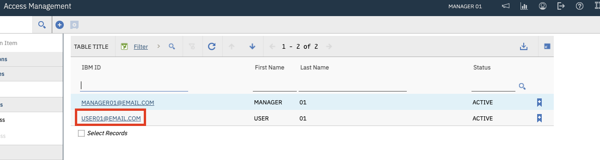{: caption="Figure 2. Select User ID" caption-side="bottom"}

4. Select the user’s Manage Access tab to view their existing accesses.

    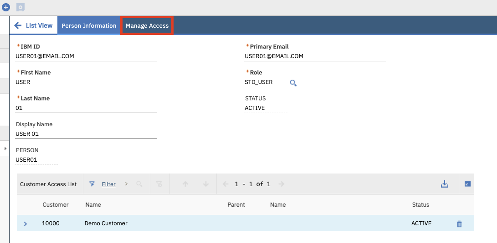{: caption="Figure 3. Manage Access Tab" caption-side="bottom"}

5. Select the asset from the Assets table that the access is linked to. This will populate all existing and pending accesses for the asset in the Specific Access in the Environment table below.

    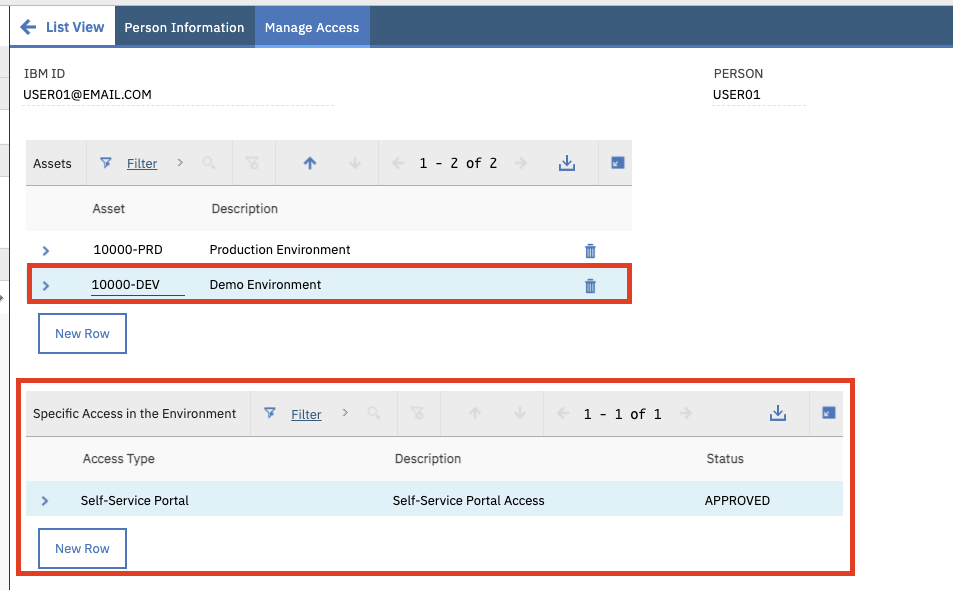{: caption="Figure 4. Select Asset" caption-side="bottom"}

6. Select the “>” icon next to the access you want to remove. This will show the access details and actions that can be run against the access.

    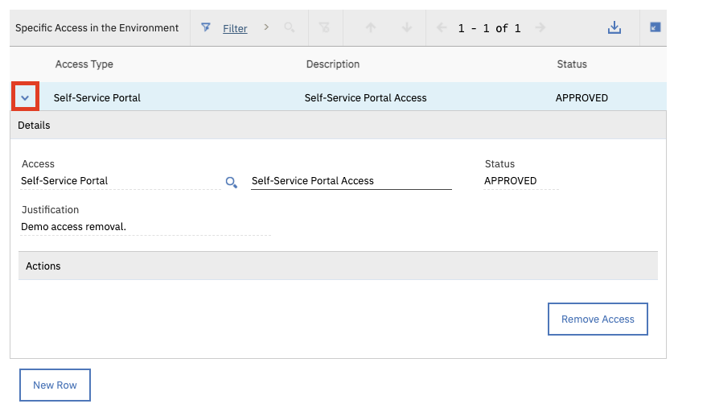{: caption="Figure 5. Select Arrow Icon" caption-side="bottom"}

7. Select the “Remove Access” button to initiate the access removal process. The access status will be updated to “PENDING REMOVAL”.

    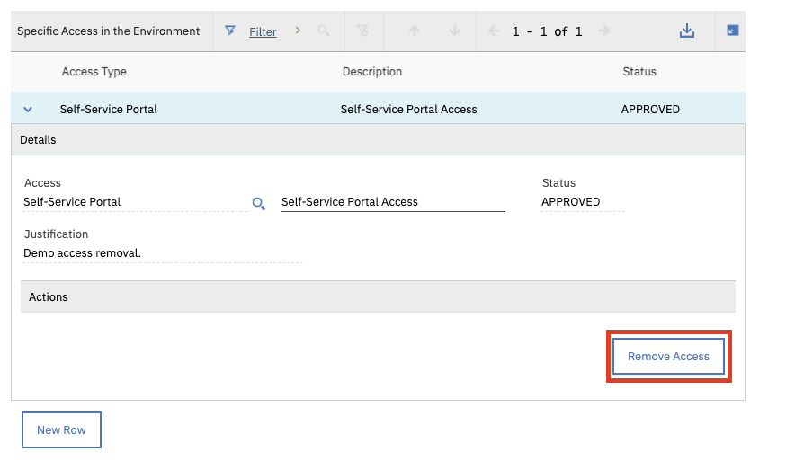{: caption="Figure 6. Remove Access" caption-side="bottom"}
    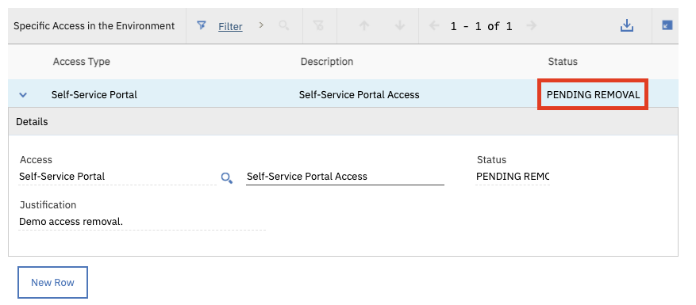{: caption="Figure 7. Pending Removal" caption-side="bottom"}

8. The status of the access will be updated to “REMOVED” once the access removal process is completed.

    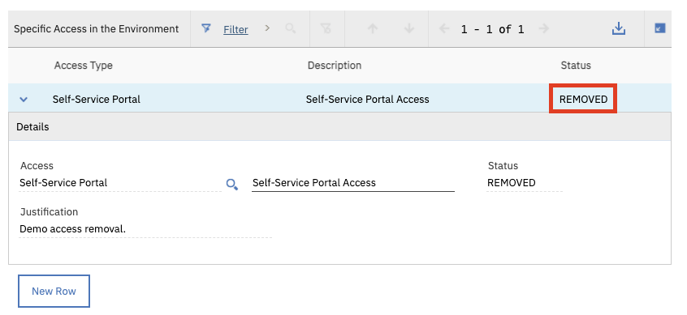{: caption="Figure 8. Status Removed" caption-side="bottom"}

## How to Grant a User Access to a Customer
{: #grant-user-access-customer-am-tool}

Managers in the Access Management application are able to grant existing users access to the customer they are managing. This process is similar to adding a new user to the Access Management tool. Once a user is granted access to a customer they can submit access requests for that customer. All access requests must be approved by a Manager User for that customer before they are granted.

Follow these steps to grant a user access to the customer you are assigned to manage.

1. Sign into the Self Service Portal: https://devops.maximo.com

2. Navigate to the Access Management tool.

    {: caption="Figure 1. Access Management Tool" caption-side="bottom"}

3. Click on the Plus (+) icon.

    {: caption="Figure 2. Plus Icon" caption-side="bottom"}

4. Enter the following information for the user you are granting customer access to. During this process a question mark (?) icon will pop up in the IBM ID field. Note: If a question mark icon does not pop up in the IBM ID field, the user does not exist yet. Follow the steps in the How to Create a New User document to create the new user. The process of creating a new user will also grant the user access to the customer you are managing.

    | Value | Description |
    | -------------- | -------------- |
    | IBM ID | The user's IBMid (email address) |
    | First Name | The user's First Name |
    | Last Name | The user's Last Name |
    {: caption="Table 1. IBMid and User Values" caption-side="bottom"}

     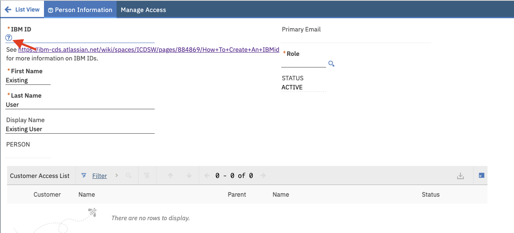{: caption="Figure 3. Enter User Information" caption-side="bottom"}

5. Select the question mark (?) icon. A message will pop up asking if you want to grant the user access to the customer you are managing. Select “Yes”.

    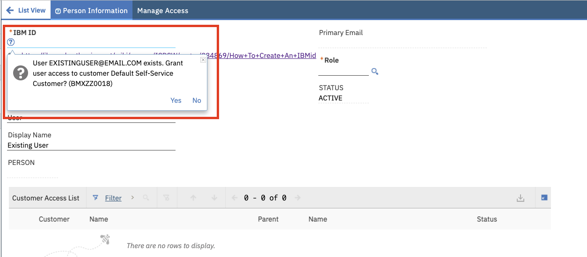{: caption="Figure 4. Grant User Access" caption-side="bottom"}

6.  Return to the List View without saving.

    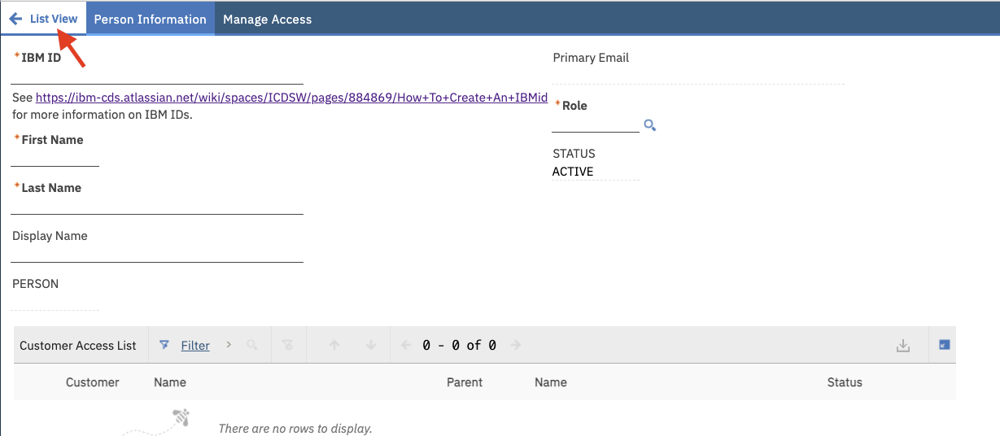{: caption="Figure 5. List View" caption-side="bottom"}

7. The user should now be viewable in your List View and have access to the customer you are managing. Note: If the user is not viewable in your List View refresh the page.

    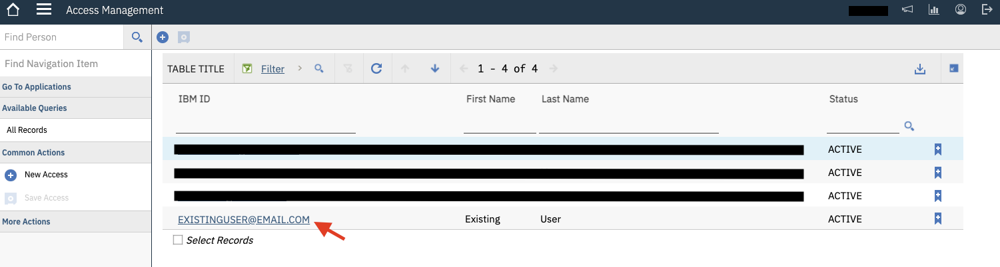{: caption="Figure 6. List View" caption-side="bottom"}

    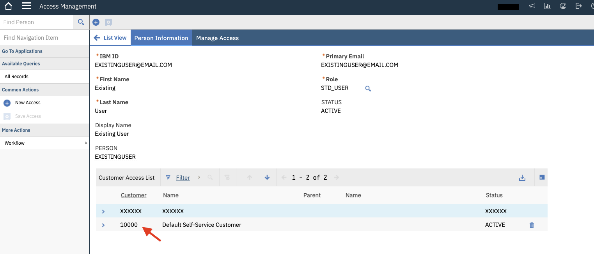{: caption="Figure 7. List View" caption-side="bottom"}

## How to Remove a User's Access to a Customer
{: #remove-user-access-customer-am-tool}

Manager users in the Access Management tool are able to remove a user’s access to submit access requests for a customer. In addition, all existing accesses linked to the customer will be removed. If the user does not have access to submit access requests for other customers, their account will be deactivated. Note: Manager user’s can only remove the customer they are managing from a user’s Customer Access List. 

Follow these steps to remove the user’s accesses if your user role is Manager.

1. Sign into the Self Service Portal: https://devops.maximo.com

2. Navigate to the Access Management application.

    {: caption="Figure 1. Access Management Application" caption-side="bottom"}

3. Select the user’s IBMid from the List View that you want to remove the accesses from.

    {: caption="Figure 2. Select IBMid" caption-side="bottom"}

4. In the Customer Access List table, select the delete icon next to the customer row you want to remove the user’s access to.

    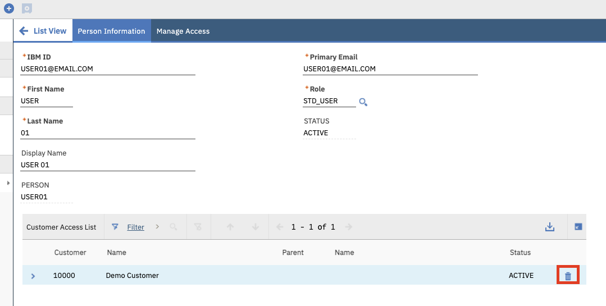{: caption="Figure 3. Delete User" caption-side="bottom"}

5. A warning message will pop-up indicating that removing the user’s access to the customer will also remove all accesses under the customer for the user. If you are removing the last customer in the user’s Customer Access List, their account will be deactivated. If you want to continue with the removal process, select “Yes”. 

    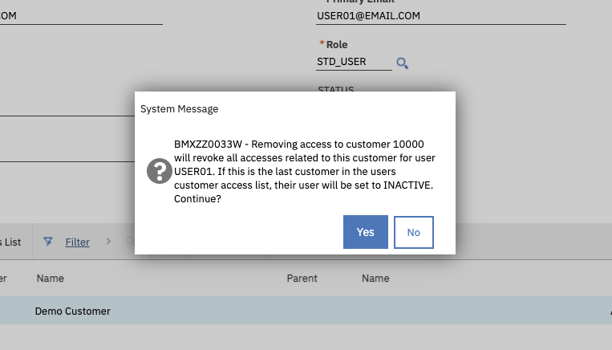{: caption="Figure 4. Warning Message" caption-side="bottom"}

6. Save the record and return to the List View. Note: The user will not be viewable in the List View because they no longer have access to the customer you are managing.

    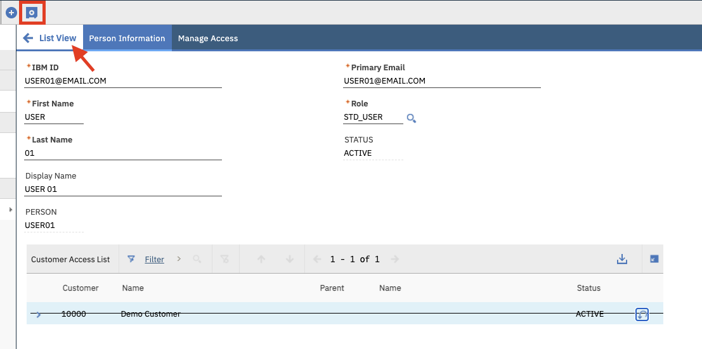{: caption="Figure 5. List View" caption-side="bottom"}

## How to Create a New User
{: #create-new-user-am-tool}

## How to Approve / Reject an Access Request
{: #approve-reject-access-am-tool}
